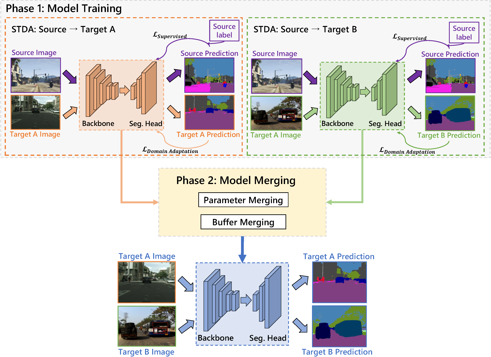

# Model Merging for Multi-Target Domain Adaptation

[](https://air-discover.github.io/ModelMerging/)  [](https://arxiv.org/abs/2407.13771) 

## Overview

In this paper, we study **multi-target domain adaptation** for enhancing the robustness of scene understanding models. While previous methods achieved commendable results through inter-domain consistency losses, they often assumed unrealistic simultaneous access to images from all target domains, overlooking constraints such as data transfer bandwidth limitations and data privacy concerns.
Given these challenges, we pose the question: How to merge models adapted independently on distinct domains while bypassing the need for direct access to training data? Our solution to this problem involves two components, **merging model parameters** and **merging model buffers** (i.e., normalization layer statistics).

For merging model parameters, empirical analyses of mode connectivity surprisingly reveal that linear merging suffices when employing the same pretrained backbone weights for adapting separate models.
For merging model buffers, we model the real-world distribution with a Gaussian prior and estimate new statistics from the buffers of separately trained models.





Our method is simple yet effective, achieving an impressive performance improvement of up to **+10.9%** beyond the prior state-of-the-art results without the need for accessing training data.


## Setup Enviroment

For this project, we used python 3.8. We recommend setting up a new virtual environment. All required packages are written in `environment.yml`, you can install with:

```shell
conda create --name modelmerging --file environment.yml
```

Then, you can activate the environment

```shell
conda activate modelmerging
```


## Setup Datasets

**Cityscapes:** Please, download leftImg8bit_trainvaltest.zip and
gt_trainvaltest.zip from [here](https://www.cityscapes-dataset.com/downloads/)
and extract them to `data/cityscapes`.

**GTA:** Please, download all image and label packages from
[here](https://download.visinf.tu-darmstadt.de/data/from_games/) and extract
them to `data/gta`.

**Synthia (Optional):** Please, download SYNTHIA-RAND-CITYSCAPES from
[here](http://synthia-dataset.net/downloads/) and extract it to `data/synthia`.

**ACDC (Optional):** Please, download rgb_anon_trainvaltest.zip and
gt_trainval.zip from [here](https://acdc.vision.ee.ethz.ch/download) and
extract them to `data/acdc`. Further, please restructure the folders from
`condition/split/sequence/` to `split/` using the following commands:

```shell
rsync -a data/acdc/rgb_anon/*/train/*/* data/acdc/rgb_anon/train/
rsync -a data/acdc/rgb_anon/*/val/*/* data/acdc/rgb_anon/val/
rsync -a data/acdc/gt/*/train/*/*_labelTrainIds.png data/acdc/gt/train/
rsync -a data/acdc/gt/*/val/*/*_labelTrainIds.png data/acdc/gt/val/
```

**Dark Zurich (Optional):** Please, download the Dark_Zurich_train_anon.zip
and Dark_Zurich_val_anon.zip from
[here](https://www.trace.ethz.ch/publications/2019/GCMA_UIoU/) and extract it
to `data/dark_zurich`.

The final folder structure should look like this:

```none
Model-Merging-MTDA

├── ...
├── data
│  ├── acdc (optional)
│  │  ├── gt
│  │  │  ├── train
│  │  │  ├── val
│  │  ├── rgb_anon
│  │  │  ├── train
│  │  │  ├── val
│  ├── cityscapes
│  │  ├── leftImg8bit
│  │  │  ├── train
│  │  │  ├── val
│  │  ├── gtFine
│  │  │  ├── train
│  │  │  ├── val
│  ├── dark_zurich (optional)
│  │  ├── gt
│  │  │  ├── val
│  │  ├── rgb_anon
│  │  │  ├── train
│  │  │  ├── val
│  ├── gta
│  │  ├── images
│  │  ├── labels
│  ├── synthia (optional)
│  │  ├── RGB
│  │  ├── GT
│  │  │  ├── LABELS
├── ...
```

**Data Preprocessing:** Finally, please run the following scripts to convert the label IDs to the

train IDs and to generate the class index for RCS:


```shell
python tools/convert_datasets/gta.py data/gta --nproc 8
python tools/convert_datasets/cityscapes.py data/cityscapes --nproc 8
python tools/convert_datasets/synthia.py data/synthia/ --nproc 8
```


### Phase 1: Model Training

You can follow the instruction in [HRDA](https://github.com/lhoyer/HRDA) to train two single target domain adaptation(STDA) models, and save the ckpt file (.pth)  

A training job can be launched using:

```shell
python run_experiments.py --config configs/hrda/gtaHR2csHR_hrda.py
```

The logs and checkpoints are stored in `work_dirs/`.


### Phase 2: Model Merging

For two single target domain adaptation(STDA) models `model1.pth` and `model2.pth` , you can merge them   with 

```shell
python3 merge.py --model_num 2 --model_1 model1.pth --model_2 model2.pth --merge_mode liner_merge --merge_buffer --save_name LinearMerge_to_save.pth
```

If you have two models with backbone ResNet101, you can merge them using git-rebasin method(current only support r
101 as backbone)


```shell
python3 merge.py --model_1 model1.pth --model_2 model2.pth --merge_mode git_rebasin --save_name gitrebasin_to_save.pth
```


### Phase 3: Model Evaluating in Multi-Target

To evaluate your merged model, you can run the following script

```shell
bash test.sh <config_file> <checkpoint_file> <log_save_file>
```


## Checkpoints

Below, we provide checkpoints of STDA models trained by HRDA and MTDA models merged by our method for different dataset settings. They come together with the log files of their evaluating.  Each row in the table indicates a model that is either trained individually (denoted by a single check) or created through the merging of two or more separately trained models (indicated by multiple checks).

| DownloadLink | Cityscapes | IDD  | ACDC | DarkZurich |
| ------------ | ---------- | ---- | ---- | ---------- |
| [1](todo)    | √          |      |      |            |
| [2](todo)    |            | √    |      |            |
| [3](todo)    |            |      | √    |            |
| [4](todo)    |            |      |      | √          |
| [5](todo)    | √          | √    |      |            |
| [6](todo)    | √          |      | √    |            |
| [7](todo)    | √          |      |      | √          |
| [8](todo)    |            | √    | √    |            |
| [9](todo)    |            | √    |      | √          |
| [10](todo)   |            |      | √    | √          |
| [11](todo)   | √          | √    | √    |            |
| [12](todo)   | √          | √    |      | √          |
| [13](todo)   | √          |      | √    | √          |
| [14](todo)   |            | √    | √    | √          |
| [15](todo)   | √          | √    | √    | √          |


## Acknowledgements

Our work is based on the following open-source projects. We thank their
authors for making the source code publicly available.

* [HRDA](https://github.com/lhoyer/HRDA)
* [DAFormer](https://github.com/lhoyer/DAFormer)
* [MMSegmentation](https://github.com/open-mmlab/mmsegmentation)


